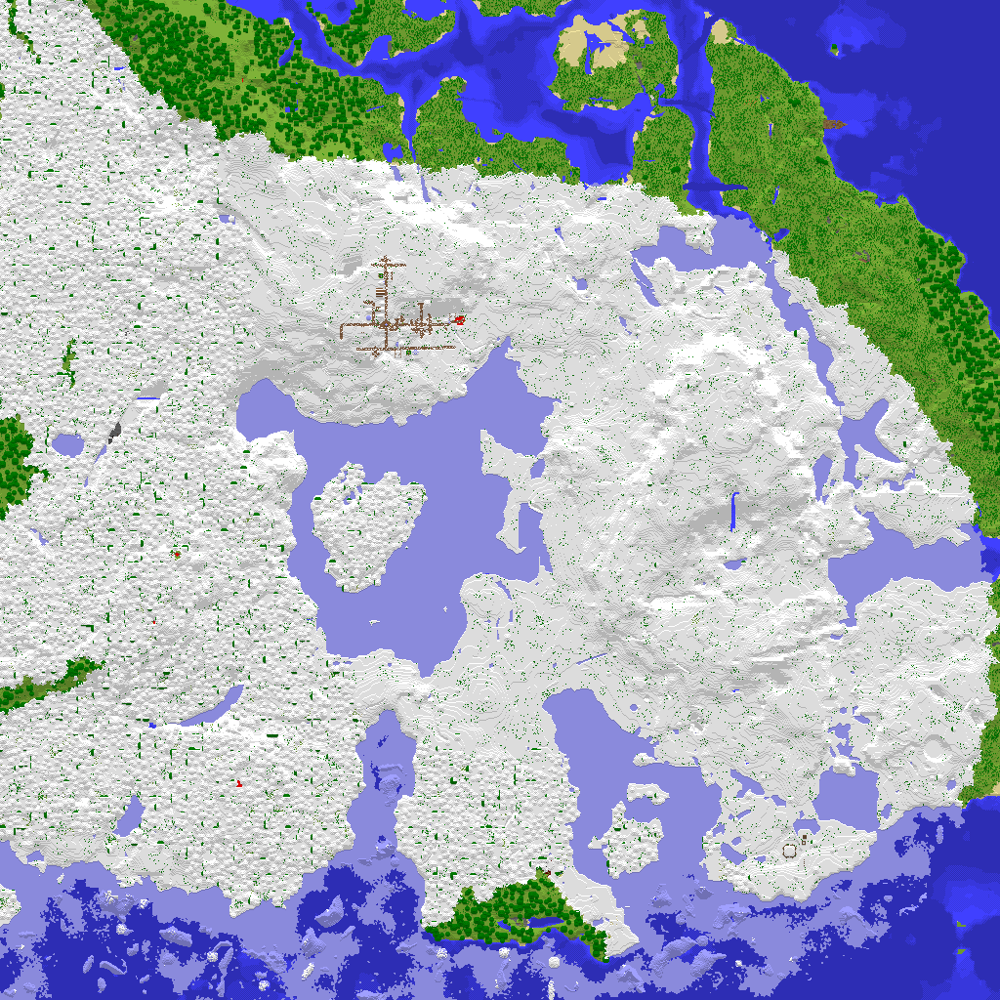

# Minecraft Map Renderer
A tool that reads a Minecraft: Java Edition world or server folder and generates a PNG map of the world.  This tool doesn't extract images from in-game map items, rather, it reconstructs the map directly from the world's data.


## Example

<!--  -->

## Installation

Make sure you have Python installed, then install the required dependencies:

```bash
pip install -r requirements.txt
```

## Usage

Run the program:

```bash
python main.py
```

Use the GUI to select a Minecraft world and generate a map image. The directory you select should contain a folder named "region". For a given Minecraft save, this folder would be found in /dimensions/minecraft/overworld


## Requirements

* Python 3.x
* NumPy
* Pillow
* nbtlib
